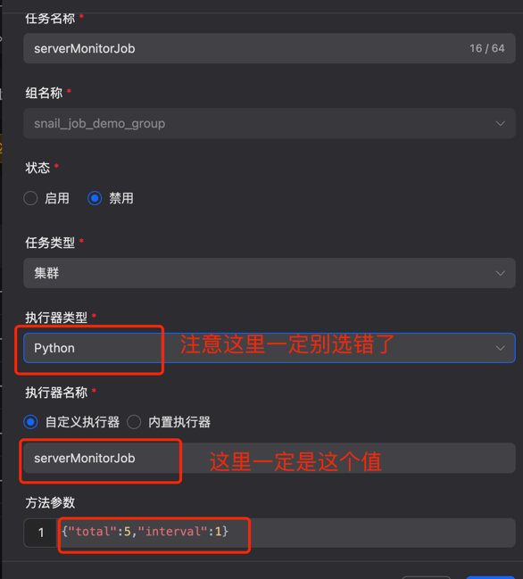
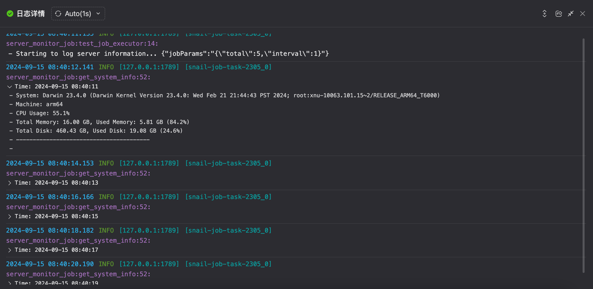

# 这个脚步的用途
定时采集服务端CPU信息、内存信息、磁盘信息并通过日志上报

# 使用步骤
1. 下载脚本
2. 将server_monitor_job.py复制到项目与demo_job.py同级目录中
3. 注册脚本
    ```python
    import server_monitor_job
    manager.register(server_monitor_job.test_job_executor)
    ```
4. 服务端配置脚本信息
   > 参数说明: 表示job执行一次本地可以间隔【interval】采集【total】次信息, 可以提高准确度

   
5. 效果展示
   
# 适配服务端版本
 服务端版本 >= 1.2.0

# 更新日志

# 其他信息
